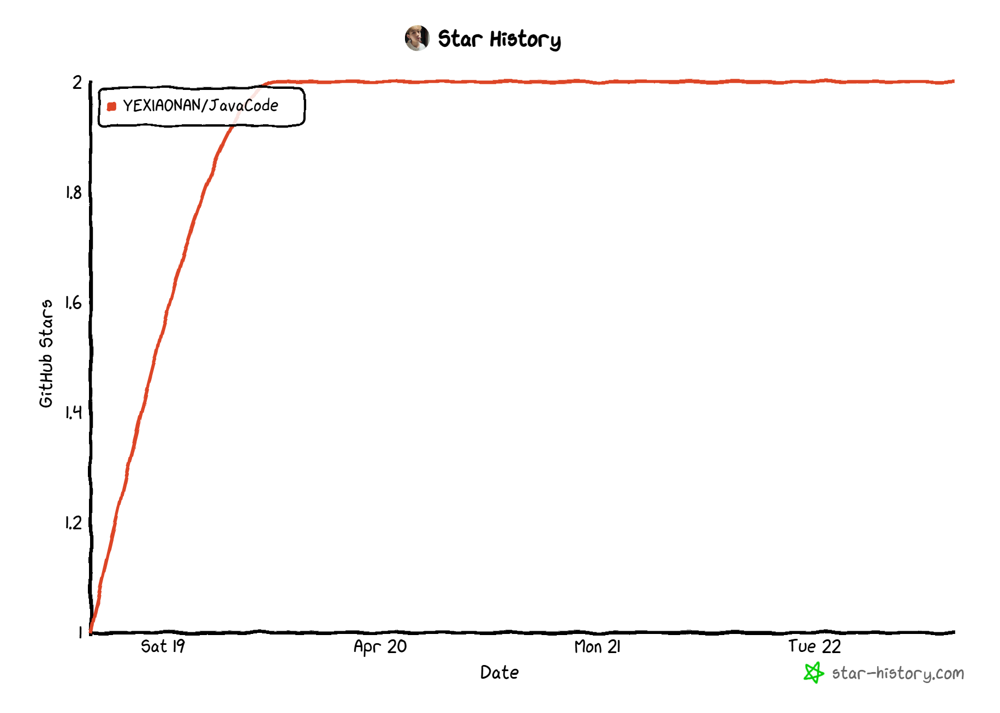

# JavaCode Repository 🚀

EngLish | [中文](https://github.com/YEXIAONAN/JavaCode/blob/main/README-ZH.md)

Welcome to the **JavaCode** repository, a comprehensive collection of Java learning resources and projects developed by **YEXIAONAN**. This repository serves as a personal archive of my journey in mastering Java, containing various examples, exercises, and small-scale projects to demonstrate key programming concepts and practices. 💻

## Table of Contents 📑
- [Introduction](#introduction)
- [Repository Structure](#repository-structure)
- [Usage](#usage)
- [Contributing](#contributing)
- [License](#license)
- [Contact](#contact)

## Introduction 🌱

This repository is a personal resource for my ongoing exploration of Java programming. It includes code examples, exercises, and projects from various stages of my learning process. The goal is to cover foundational topics as well as more advanced Java techniques. This repository serves both as a reference for myself and a learning tool for anyone interested in Java programming. 📚

## Repository Structure 🗂️

The repository is organized into the following sections:

- **Basic Concepts**: Fundamental programming topics such as data types, control flow, and object-oriented principles. 📖
- **Advanced Topics**: Exploration of more complex concepts including concurrency, networking, and database connectivity. 🔧
- **Projects**: Practical applications and mini-projects showcasing the implementation of Java concepts in real-world scenarios. 📊
- **Exercises**: Problem-solving exercises intended to reinforce core Java skills and best practices. 📝

Each folder or file is labeled appropriately to make it easy for users to navigate and locate the resources they need.

## Usage 🏃‍♂️

To begin exploring the code, clone this repository to your local machine:

```bash
git clone https://github.com/YEXIAONAN/JavaCode.git
```

Once you have cloned the repository, you can navigate to individual folders to review the code. Each project or exercise should be self-contained, with instructions for running the code included in the respective files. For more complex projects, you may need to import the code into your favorite IDE (e.g., IntelliJ IDEA or Eclipse) to execute and explore the functionality. 💡

## Contributing 🤝

While this repository is primarily for my personal use, contributions are always welcome! If you have suggestions, improvements, or additional resources to share, feel free to fork the repository and submit a pull request. Please ensure that any contributions adhere to best practices and follow Java coding standards. 🔄

### Guidelines for Contributing:
- Ensure your code is well-commented and follows standard Java conventions. 🖋️
- Add a brief description of your changes and their intended purpose. 📋
- Write meaningful commit messages that describe your contributions. 💬

## License 📜

This repository is licensed under the [MIT License](LICENSE), which allows you to freely use, modify, and distribute the code, as long as you include the original license and copyright notice in your copies. 🔓

## Contact 📬

For any questions, feedback, or inquiries, please feel free to reach out to me:

- GitHub: [YEXIAONAN](https://github.com/YEXIAONAN)
- Email: yexiaonanair@outlook.com

Thank you for exploring this repository. Happy coding! ✨


## 🤝 Contributors

A huge thank you to everyone who has contributed to this project! Every commit, issue, and pull request helps make **JavaCode** better for everyone.

### 📊 Contributor Stats

[](https://github.com/YEXIAONAN/JavaCode/graphs/contributors)

> Image generated by [contrib.rocks](https://contrib.rocks) to show the project's contributor avatars in real time.

### 🧭 How to Contribute

We welcome contributions of all kinds — bug fixes, feature additions, documentation improvements, and more. Here’s how you can get involved:

1. **Fork the repository**: Click the "Fork" button at the top right corner.
2. **Clone your fork**: Run `git clone https://github.com/your-username/JavaCode.git`.
3. **Create a new branch**: Use `git checkout -b feature/your-feature-name`.
4. **Make your changes** and commit with a meaningful message.
5. **Push your branch** to your GitHub fork: `git push origin feature/your-feature-name`.
6. **Open a Pull Request**: Go to the original repository and open a new PR describing your changes.
> For detailed guidelines, see the [CONTRIBUTING.md](./CONTRIBUTING.md) file (if available).

> Want to see your name here? Open a pull request and help improve the project!
now if you'd like to generate the correct contributor avatars using real GitHub user IDs or automate this section with GitHub Actions.

## Star History

