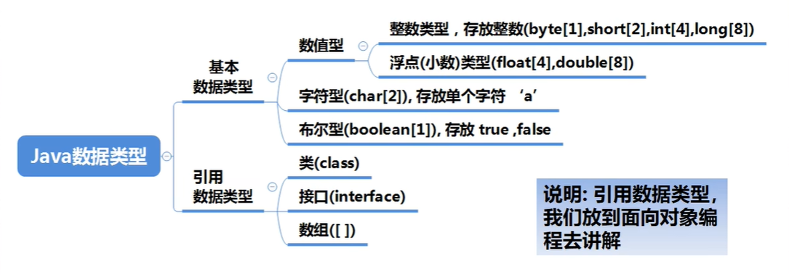

## Java基础

> 痛定思痛，在之前的学习Java过程中感觉之前学习的都没有很理解，因为之前看的是某马程序员的课程，前面还好，到后面感觉不怎么理解了。所以说就打算重新来学习一遍Java，本次课程看的是韩老师的课程编写。

在本文档中，你将会学习到Java的一些基础语法，以及一步一步深入Java语言的学习！

----
### Java的重要特点
 1.Java语言是面向对象的（oop）

 2.Java语言是健壮的

 3.Java语言是跨平台的【即：一个平台写好可以分发到其他平台运行，无需二次处理】

 4.Java语言是解释型的
 解释型语言，编译后的代码不能直接被机器运行，需要解释器来执行，编译型语言，编译后的代码，可以直接被机器执行。

### Java运行机制以及运行过程

- Java核心机制 - Java虚拟机【Jvm Java Virtual Machine】
  - 1）JVM是一个虚拟的计算机，具有指令集并使用不同的存储区域。负责执行指令，管理数据，内存，寄存器，包含在JDK中。
  - 2）对于不同的平台，有不同的虚拟机
  - 3）Java虚拟机机制屏蔽了底层运行平台的差异，实现了“一次编译，到处运行”

### Java中JDK和JRE的区别

- JDK 基本介绍
  - JDK（Java Development Kit `Java开发工具包`）
  - JDK = JRE + Java的开发工具 [Java，Javac，JavaDoc，JavaP等]
  - JDK是提供给Java开发人员使用的，其中包含了Java的开发工具，也包括了JRE。所以安装了JDK就不用安装JRE了。
- JRE 基本介绍
  - JRE （Java Runtime Environment `Java运行环境`）
  - JRE = JVM + Java核心类库[类]
  - 包括Java虚拟机（JVM Java Virtual Machine）和Java所需的核心类库等，如果想要运行一个开发好的Java程序（Test.class）计算机中只需要安装JRE即可。
- JDK，JRE和JVM的包含关系
  - JDK = JRE + 开发工具集 （例如javac，java编译工具等）
  - JRE = JVM + Java SE标准类库（Java核心类库）
  - 提一嘴，在生产环境中。可能你的组员并不使用JDK来编写代码文件，那么你的组员就只需要安装JRE（JVM Java虚拟机）即可。

### Java开发注意事项细节说明

1.Java源文件以.java为扩展名。源文件的额基本组成部分是类（class）

2.Java程序的执行入口是main()方法。具有固定的书写格式

3.Java语言严格区分大小写。

4.Java方法由一条条的语句构成，每个语句以“;”结束

5.大括号都是承兑出现的，缺一不可。

6.一个源文件中最多只能有一个public类。其他类个数不限。

7.如果源文件包含一个public类，则该文件必须按照该类名来命名。

8.一个源文件中最多只能有一个public类，其他类的个数不限，也可以将main方法写在非public类中，然后指定非public类运行，这样入口的方法的就是非public的main方法

### Java常用的转义字符
1）\t：一个制表位，实现对齐功能

2）\n：换行符

3）\\：一个\

4）\"：一个"

5）\'：一个'

6）\r：一个回车 System.out.println("HelloWorld\r南宁")

### Java文档注释
> 在Java中，注释有三种，分别是单行注释，多行注释，文档注释

```java
// 我是单行注释
```

```java
/*
我是多行注释
 */
```

```java
/**
 * 我是文档注释
 */
```
### Java代码规范
1. 类，方法的注释，要以JavaDoc的方式
2. 非Java Doc的注释，往往是给代码的维护者看的，着重告诉读者为什么这样写，如何修改，注意什么问题等
3. 使用Tab操作，实现缩进，默认整体向右移动，时候使用Shift+Tab整体向左移
4. 运算符和 = 两边习惯性各加一个空格。比如：2+4*5+345-89
5. 源文件使用utf-8编码
6. 行宽度不要超过80字符
7. 代码编写次行风格和尾行风格

### Java基本数据类型转换
- 介绍
  - 当Java程序在进行赋值或者运算时，精度小的类型自动转换为精度大的数据类型，这个就是`自动类型转换`
- 数据类型按照精度（容量）大小排序为

`char` > `int` > `long` > `float` > `double`

`byte` > `short` > `int` > `long` > `float` > `double`



- 自动类型转换注意细节

1. 有多种类型的数据混合运算时，系统首先自动将所有数据转换成容量大的数据类型，然后再进行计算。
2. 当我们把精度大的数据类型赋值给小的数据类型时，就会报错，反之将会进行自动类型转换
3. （byte，short）和char之间不会相互自动转换
4. byte，short，char他们三者可以计算，在计算时首先转换为int类型
5. Boolean不参与转换！！！
6. 自动提升原则：表达式结果的类型自动提升为 操作数中的最大类型


- 强制类型转换

- 自动类型转换的逆过程，将容量大的数据类型转换为容量小的数据类型。使用时要加上强制转换符号（），但可能造成精度降低或者溢出，格外注意！！！

**案例**

```java
public class ForceConvert {
  public static void main(String[] args) {
    int i = (int)1.9;
    System.out.println(i);

    int j = 100;
    byte b1 = (byte)j;
    System.out.println(b1);
  }
}
```

强制类型转换细节说明：

  1.当进行数据的大小从 大———>小，就需要使用到强制类型转换
  2.强制转换符号只针对与最近的操作数有效，往往会使用小括号提升优先级
 ```java
 public class ForceConvertDetail {
  public static void main(String[] args) {
    // 如果需要对多种数据进行求和，需要使用（）来提升计算的优先级，然后才能进行编译。
    // 例如像下方的代码就是无法运行的，因为其最终得到的数据类型与赋值数据类型不相符
    //int x = (int)10*3.5+6*1.5;
    
    // 正确写法：
    int x = (int)(10*3.5+6*1.5);
    System.out.println(x);
  }
}
 ```
   3.char类型可以保存int的常量值，但不能保存int的变量值，需要强转
 ```java
 public class ForceConvertDetail {
  public static void main(String[] args) {
    char c1 = 100;
    int m = 100;

    // char 只能保存常量，不能覆盖变量值
    char c2 = m; // Error
    // 强制类型转换
    char c3 = (char)m; // OK

  }
}

 ```
  4.byte和short类型在进行运算时，当作int类型处理


### Java内置数据类型
> Java语言提供了八种基本类型。六种数字类型（四个整数型，两个浮点型），一种字符类型，还有一种布尔型。

- byte：
byte 数据类型是8位、有符号的，以二进制补码表示的整数；
最小值是 -128（-2^7）；
最大值是 127（2^7-1）；
默认值是 0；
byte 类型用在大型数组中节约空间，主要代替整数，因为 byte 变量占用的空间只有 int 类型的四分之一；
例子：byte a = 100，byte b = -50。


- short：
short 数据类型是 16 位、有符号的以二进制补码表示的整数
最小值是 -32768（-2^15）；
最大值是 32767（2^15 - 1）；
Short 数据类型也可以像 byte 那样节省空间。一个short变量是int型变量所占空间的二分之一；
默认值是 0；
例子：short s = 1000，short r = -20000。


- int：
int 数据类型是32位、有符号的以二进制补码表示的整数；
最小值是 -2,147,483,648（-2^31）；
最大值是 2,147,483,647（2^31 - 1）；
一般地整型变量默认为 int 类型；
默认值是 0 ；
例子：int a = 100000, int b = -200000。


- long：
long 数据类型是 64 位、有符号的以二进制补码表示的整数；
最小值是 -9,223,372,036,854,775,808（-2^63）；
最大值是 9,223,372,036,854,775,807（2^63 -1）；
这种类型主要使用在需要比较大整数的系统上；
默认值是 0L；
例子： long a = 100000L，long b = -200000L。
"L"理论上不分大小写，但是若写成"l"容易与数字"1"混淆，不容易分辩。所以最好大写。


- float：
float 数据类型是单精度、32位、符合IEEE 754标准的浮点数；
float 在储存大型浮点数组的时候可节省内存空间；
默认值是 0.0f；
浮点数不能用来表示精确的值，如货币；
例子：float f1 = 234.5f。


- double：
double 数据类型是双精度、64 位、符合 IEEE 754 标准的浮点数；
浮点数的默认类型为 double 类型；
double类型同样不能表示精确的值，如货币；
默认值是 0.0d；
```
例子：

double   d1  = 7D ;
double   d2  = 7.;
double   d3  =  8.0;
double   d4  =  8.D;
double   d5  =  12.9867;
7 是一个 int 字面量，而 7D，7. 和 8.0 是 double 字面量。 
```


- boolean：
boolean数据类型表示一位的信息；
只有两个取值：true 和 false；
这种类型只作为一种标志来记录 true/false 情况；
默认值是 false；
例子：boolean one = true。


- char：
char 类型是一个单一的 16 位 Unicode 字符；
最小值是 \u0000（十进制等效值为 0）；
最大值是 \uffff（即为 65535）；
char 数据类型可以储存任何字符；
例子：char letter = 'A';。


- 基本数据类型和String类型的转换
  - 介绍
    - 在程序开发中，我们经常需要将数据类型转换成String类型。或者将String类型转换成基本的数据类型。
  - 基本类型转String类型
    - 语法：将基本的数据类型的值 + "" 即可
 ```java
public class StringToBasic {
  public static void main(String[] args){
    // 基本数据类型 ——> String
    int n1 = 100;
    float f1= 100F;
    double d1 = 5.5;
    boolean b1 = false;


    String s1 = n1 + "";
    String s2 = f1 + "";
    String s3 = d1 + "";
    String s4 = b1 + "";

    System.out.println(s1+s2+s3+s4);


  }
}
 ```
  - String类型转基本数据类型
    - 语法：通过基本类型的包装类调用parseXX方法即可
```java
public class StringToBasic {
  public static void main(String[] args){
    // String——>转换基本类型
    String s5 = "123";

    // 一学就会，使用ParseXX转换
    int sum = Integer.parseInt(s5);
    float sum2 = Float.parseFloat(s5);
    double sum3 = Double.parseDouble(s5);
    long sum4 = Long.parseLong(s5);
    byte sum5 =  Byte.parseByte(s5);
    boolean sum6 = Boolean.parseBoolean("true");

    System.out.println(sum6);
  }
}
```


### Java算数运算符

- **目录**

- [运算符介绍](#运算符介绍)

- [算术运算符](#算术运算符)

- [关系运算符](#关系运算符)

- [逻辑运算符](#逻辑运算符)

- [赋值运算符](#赋值运算符)

- [三元运算符](#三元运算符)

- [运算符优先级](#运算符优先级)

----

#### 运算符介绍

- 运算符介绍

运算符是一种特殊的符号，用于表示数据的运算，赋值和比较等


#### 算术运算符

- 介绍

算术运算符是对数值类型的变量进行运算的，在Java程序中使用的非常多


- % 取模看作一个公式
- a % b = a - a / b * b

自增：++

作为独立语句使用：

前++和后++都完全等价于 i = i + 1;

作为表达式使用

  前++：++i先自增后赋值

  后++：i++先赋值后自增
#### 关系运算符
- 介绍

 1.关系运算符的结果都是boolean类型，也就是要么是true，要么是false

 2.关系表达式 经常用在if结构的条件中或者循环结构的条件中


- 细节说明

1.关系运算符组成的表达式，我们称之为关系表达式 a > b

2.比较运算符“==”不能误写为“=”
#### 逻辑运算符
- 介绍
用于链接多个条件（多个关系表达式），最终的结果也是一个boolean类型


- && 与 & 基本规则

| 名称     | 语法           | 特点                         |
| -------- | -------------- | ---------------------------- |
| 短路与&& | 条件1 && 条件2 | 两个条件都为true，结果为true |
| 逻辑与&  | 条件1&条件2    | 两个条件都为true，结果为true |


- && 与 &的区别

1.&&短路与：如果第一个条件为false，则第二个条件不会被判断，最终结果为false，效率高

2.&逻辑与：不管第一个条件是否为false，第二个条件都要判断，效率低

3.开发中，基本使用效率最高的&&

#### 赋值运算符
- 介绍

赋值运算符就是将某个运算后的值，赋给指定的变量

- 赋值运算符的分类

✔基本赋值运算符 = 

✔复合赋值运算符 +=,-=,*=,/=,%=等

- 例如

a += b; [等价于 a = a + b]

a -= b; [等价于 a = a - b]

- 赋值运算符的特点

1. 赋值顺序从右往左 int sum = a + b + c
2. 赋值运算符额左边，只能是变量，右边可以是变量，表达式，常量值 int num = 20 
3. 复合赋值运算符等价于 a += 3 ; a = a + 3
4. 复合赋值运算符会进行类型转换

byte b = 2 ; b += 3; b++

#### 三元运算符

- 基本语法

条件表达式？表达式1：表达式2；

- 运算规则

1.如果条件表达式为true，运算后的结果是表达式1

2.如果条件表达式为false，运算后的结果是表达式2

口诀：[一真大师]

#### 运算符优先级

- 运算符有不同的优先级，所谓优先级就是表达式运算中运算顺序。
- 只有单目运算符，赋值运算符是从右向左运算的。


### Java标识符命名规则和规范


- 运算符有不同的优先级，所谓优先级就是表达式运算中运算顺序。
- 只有单目运算符，赋值运算符是从右向左运算的。


### Java标识符命名规则和规范

- 标识符概念
1. Java对各种变量，方法和类等命名时使用的字符序列称为标识符
2. 凡是自己可以起名字的地都叫标识符

- 标识符的命名规则（必须遵守）
1. 由26个英文字母大小写组成，0-9，_或$组成
2. 数字不可以作为开头
3. 不可以使用关键字或者保留字，但能包含关键字和保留字
4. Java中严格区分大小写，长度无限制
5. 标识符不包含空格

- 标识符命名规范
1. 包名：多单词组成时所有字幕都小写；aaa.bbb.ccc
2. 类名：接口名：多单词组成时，所有单词的首字母大写；ArrayList
3. 变量名，方法名：多单词组成时，第一个单词首字母小写，第二个单词开始每个单词首字母大写：studentManager
4. 常量名：所有字幕都大写，多个单词拼接时，每个单词用下划线链接；SCHOOL_TEACHER_SUM


### JavaScanner的使用

> 在Java中没有类似Python的input语句，我们只能使用官方java.util的库来完成这个操作。

首先导入Scanner

```java
import java.util.Scanner;

Scanner sc = new Scanner(System.in);

public static void main(String[] args) {
  // 引导用户输入
  System.out.println("请输入您的名字：");
  String name = sc.next();
  // 将用户输入的名字存储在“name”变量中，这个变量是String类型，并且 next() 也是接受String类型。
}


```

### Java进制
- 进制介绍
对于整数，有四种表达方式：
1. 二进制：0,1 满二进一，以0b或者0B开头
2. 十进制：0-9 满十进一
3. 八进制：0-7 满八进一 以数字0开头表示
4. 十六进制：0-9及A(10)-F(15) 满16进一.以0x或0X开头表示

- 进制的转换


- 二进制在运算中的说名
1. 二进制是逢2进位的位进制，0  1 是基本算符。
2. 现代的电子计算机技术全部采用的是二进制，因为它使用0，1两个数字符号，非常简单方便，易于用电子方式实现。计算机内部处理的信息，都是采用二进制数来表示。二进制（Binary）数用0和1两个数字及其组合来表示任何数。位进规则是“逢2进1”，数字1在不同的位上代表不同的值，按从右至左的次序，这个值以二倍递增。


### Java原码，反码，补码

- 对于有符号的而言：
1. 二进制的最高位是符号位：0表示正数，1表示负数（口诀：0-> 0 1 -> -）
2. 正数的原码，反码，补码都一样（三码合一）
3. 负数的反码=它的原码符号位不变，其他位取反（0-> 1 , 1 -> 0）
4. 负数的补码=他的反码+1，负数的反码=负数的补码-1
5. 0的反码，补码都是0
6. Java没有无符号数，换言之，java中的数都是有符号的
7. 在计算机运算的时候，都是以**补码的方式来运算**的
8. 当我们看运算结果的时候，要看他的原码

- 运算符有不同的优先级，所谓优先级就是表达式运算中运算顺序。
- 只有单目运算符，赋值运算符是从右向左运算的。


### Java程序控制结构
- 顺序控制
- 分支控制（if,else,switch）
- 循环控制（for,while,do...while,多重循环）
- break
- continue
- return

- 顺序控制介绍
  - 程序从上到下逐行执行，中间没有任何判断和跳转.

- 分支控制 if-else 介绍
  - 让程序有选择的执行，分支控制有三种

1）单分支
2）双分支
- 基本语法
```java
if(条件表达式){
    执行代码;(可以有多条语句)
}else{
    执行代码;(可以有多条语句)
}
```
> 当条件表达式里面的内容为true，则会执行{}里面的代码。如果为false则不执行
>
> 特别说明：如果{}中只有一条语句，则可以不加上{}，建议写上{}

3）多分支

